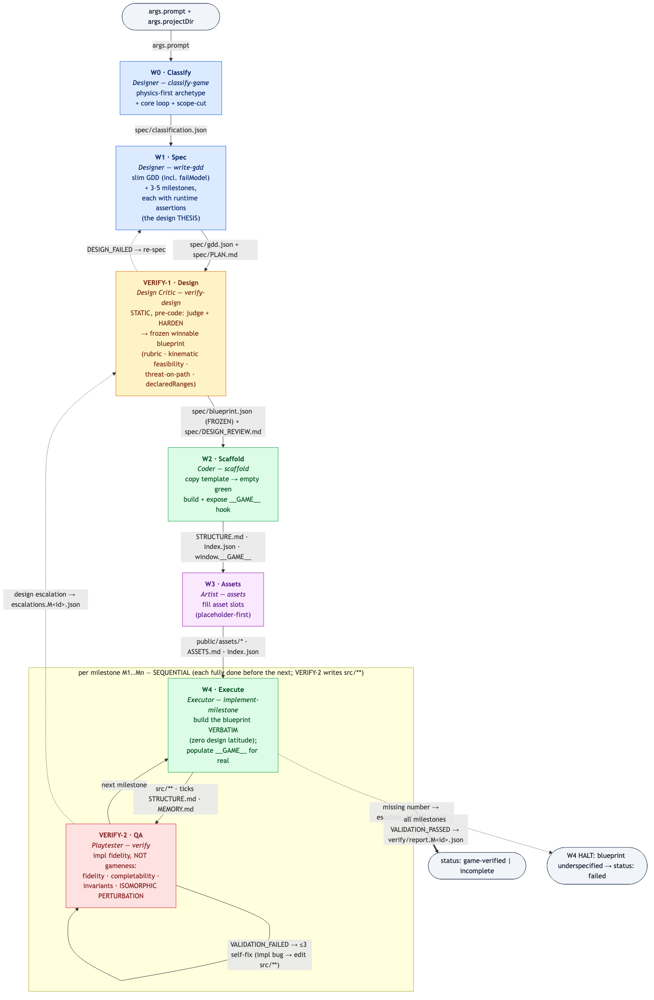
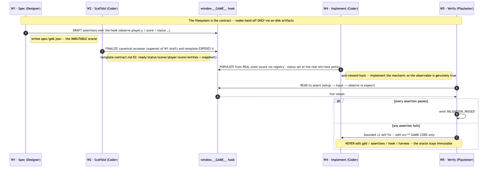
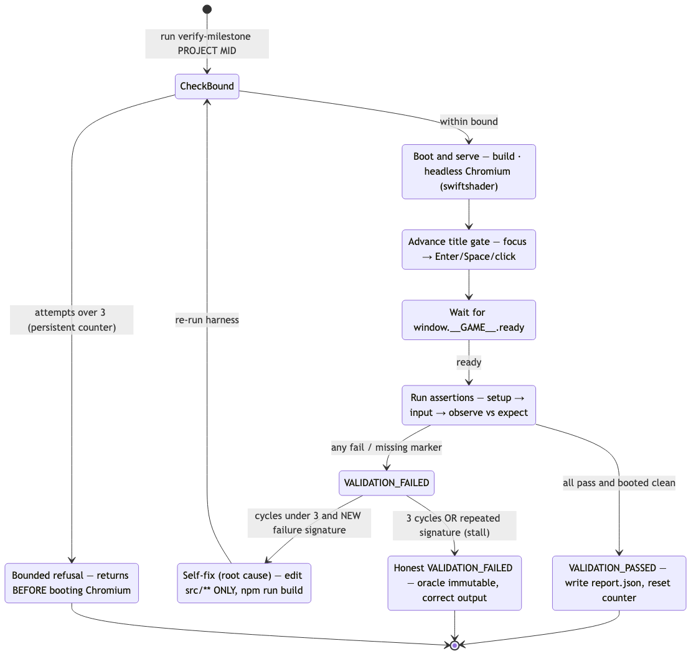

# game-omni

An AI **game-generation engine**: one text prompt → a **verified, playable Phaser 2D web game** in one pass.

It is a **workflow that orchestrates a skill system** — seven nodes, each loading one evidence-grounded skill,
coordinating only through on-disk files. The single source of truth is `.claude/workflows/game-omni.js`, and it
runs identically on Claude (the `game-omni` Workflow) or cheaply on **pi** (`pi-runner/`).

```
W0 Classify → W1 Spec → VERIFY-1 Design → W2 Scaffold → W3 Assets → (per milestone: W4 Execute → VERIFY-2 QA)
prompt ─────► gdd ────► FROZEN blueprint ─► empty game ─► art ─► verbatim build ─► VALIDATION_PASSED
```

**Separation of powers** (the 2026-06-10 redesign): a **DESIGN** gate (`VERIFY-1`) judges + freezes gameness
*before* any code; a **QA** gate (`VERIFY-2`) checks *implementation fidelity* to that frozen design *after* —
so no node ever grades homework it wrote itself.



Success = **VERIFY-2** passes for every milestone: the game builds, boots headless, and the build is a faithful,
perturbation-invariant realization of the frozen blueprint — emitting `VALIDATION_PASSED` with zero human edits.

## Run it
```bash
# free: print the realized 11-stage DAG (no model called)
node pi-runner/extract.mjs

# on pi (cheap), in the background; status → out/<id>/run-status.json
node pi-runner/run.mjs --run myrun --arg prompt="a coin-collecting platformer" --arg projectDir=out/game --debug
```
On Claude, invoke the `game-omni` Workflow with `args.prompt`. What each node does + how to improve it: **`CLAUDE.md`**.

## Architecture

The pipeline above is the runtime spine; its edge labels are the **on-disk artifacts** that are the *only*
channel through which nodes coordinate (node color = role). Two diagrams unpack how it works — the cross-node
contracts, then the VERIFY-2 gate:

### The two load-bearing cross-node contracts — `spec/blueprint.json` + `window.__GAME__`



Two linchpins now. **`spec/blueprint.json`** is VERIFY-1's hardened, frozen, *winnable* design — the single
source of truth for W2/W3/W4/VERIFY-2 (the `gdd.json` thesis stays only as immutable provenance).
**`window.__GAME__`** is the observable test hook: **W1 drafts** assertions over it → **VERIFY-1 hardens** them
into Given/When/Then `acceptanceCriteria` + a proven `referenceSolution` + a `declaredRanges` perturbation
envelope → **W2 finalizes & exposes** the canonical accessor → **W4 populates** it from real state → **VERIFY-2
reads** it to assert *fidelity*. Both oracles (the assertions / `gdd.json` / `blueprint.json` / the hook / the
harness) are **immutable** — the anti-reward-hack spine.

### VERIFY-2 — the six-gate QA pass + bounded ≤3 self-fix



VERIFY-2 runs six gates — build-health · user-flow fidelity · completability · invariants · **isomorphic
perturbation** · verdict self-guard — then *classifies* any failure: an **implementation bug** (build ≠
blueprint) → bounded ≤3 self-fix that edits `src/**` game code only; a genuine **design problem** (the frozen
blueprint is wrong even when built faithfully) → escalate to VERIFY-1, never patched here. The harness owns a
persistent per-milestone counter; past 3 attempts it refuses **before** booting Chromium (cost-capped). An
honest `VALIDATION_FAILED` at the bound is the correct output, not a defeat.

> Diagram sources + SVG/PNG exports live in [`docs/diagrams/`](docs/diagrams/); regenerate with
> `mmdc -i <f>.mmd -o <f>.png -w 2048 --backgroundColor white`.

## The chain's constitution (cross-cutting design philosophy)

Encoded once in `game-omni.js`, never copied into the skills:

- **The filesystem IS the contract.** Nodes coordinate ONLY through on-disk artifacts. A node's JSON output
  is merely the orchestrator's *receipt*; the durable truth is the file it wrote. This forces clean hand-off
  boundaries and makes the pipeline resumable and **Pi-portable**.
- **Separation of powers — verification is two nodes, not one.** A DESIGN gate (`VERIFY-1`) judges + *freezes*
  gameness STATICALLY before any code; a QA gate (`VERIFY-2`) checks IMPLEMENTATION FIDELITY to that frozen
  blueprint after. No node grades state it populated itself — the self-grading coupling the old single verify
  node had. The executor (`W4`) in between has **zero design latitude**.
- **One `agent()` call per node, with a forced-JSON `schema`** — deterministic and statically extractable;
  the Pi extractor sees fixed lanes, never model-invented control flow.
- **A shared `PREAMBLE` is injected into every node:** _filesystem-is-contract · load your SKILL · generalize ·
  stay in your lane_. The chain's discipline lives in the workflow; each skill carries only its craft.
- **Evidence-grounded skills.** Each node loads `packages/skills/<name>/SKILL.md`, authored by its own research
  sub-agent; every practice cites its provenance — no rule rests on a guess.
- **Pi-portability by construction.** Fan-outs are discovered-once lists with **static defaults** (milestones
  default to 3) — never extractor-invisible, data-dependent branching.
- **The 4-layer contract per node:** ① `PREAMBLE` (discipline) ② `SKILL` (craft) ③ `schema` (the forced JSON
  shape Claude validates) ④ the **OUTPUT CONTRACT** (`DRIVER-ARTIFACTS:` / `DRIVER-OWNS:` markers the Pi driver
  verifies **on disk, independent of the self-report** — a missing required artifact ⇒ `blocked`).
- **Anti-reward-hack is absolute.** Assert **observable** state only. The oracle — the assertions, `gdd.json`,
  the frozen `blueprint.json` + its `referenceSolution`, the `window.__GAME__` hook, and the verify harness —
  is **immutable**. A fix changes real `src/**` behavior, never the test (and never widens a `declaredRange`).
- **Green ≠ good. The human is the eye.** A green VERIFY-2 means "the build is a faithful realization of the
  frozen design," never "the game is good." Gameness is VERIFY-1's static call; fun, legibility, and tension
  are ultimately judged by a person — we deliberately do **not** add reward-hackable "fun" assertions.
- **Hermes stewardship.** Improve a *wave* by editing its SKILL; improve the *chain* by editing `game-omni.js`.
  One canonical home, smallest durable edit, generalize or don't ship.

## Per-node design philosophy

### W0 · Classify — Designer · `classify-game`
`args.prompt` → `spec/classification.json` (archetype · coreLoop · coreVerb · physicsProfile · **scopeCut**).
- **Physics-first routing:** route by **physics and perspective, never the genre word.** Three physics
  key-questions collapse any prompt onto one archetype from the closed set `{platformer, top_down, grid_logic,
  tower_defense, ui_heavy}`. Physics is the invariant that survives the genre label, and the archetype selects
  the W2 template — so the routing key must be physical, not lexical.
- **The `scopeCut` (4–8 items) is the anti-slop guardrail.** Over-scope is the #1 failure mode of one-pass
  generation, so W0 commits *what is deliberately OUT of v1* up front. Cut anything not serving the core loop;
  **never cut the juice / game-feel.**
- The one-line **core loop** (verb + goal + obstacle + fail) and single **coreVerb** are the spine everything
  else serves. Deterministic; gibberish → `platformer` default; no-fit → closest + `confidence:"low"`.

### W1 · Spec — Designer · `write-gdd`
`spec/classification.json` → `spec/gdd.json` (slim gameDNA incl. machine-readable **failModel** + **3–5 milestones**) + `spec/PLAN.md` — the design
*thesis* VERIFY-1 hardens into the frozen blueprint.
- **Slim GDD, constrained to the template.** Never invent a capability the template lacks — the GDD is a
  *composition* of template hooks, not a wishlist.
- **Milestones are playable vertical slices, not tasks.** Default 3: **M1 = the core loop plays at all**; the
  final milestone carries a win/lose **end-state**. Build order is playability order.
- **Executable runtime assertions** — the defining idea. Each milestone gets assertions in _Given setup → When
  input → Then observe + expect_ form over `window.__GAME__`, **1:1 with the acceptance criteria**, asserting
  **observable behavior, never implementation**. W1 *invents* this hook contract shape; downstream absorbs it.
- **§3.5 — design the PLAYABLE SPACE** (added by Hermes from real-run findings): **reachability** (objective
  reachable via the documented verb, enforced by a required final-milestone reachability assertion — an
  un-fakeable win-path), **legibility**, **onboarding**, and **CHALLENGE** (the threat must lie *on/astride* the
  reward path so the loop is a real risk decision — tension stays human-judged, not a brittle assertion).

### VERIFY-1 · Design — Design Critic · `verify-design`
`spec/gdd.json` + `spec/classification.json` + `spec/PLAN.md` → **`spec/blueprint.json`** (the frozen design) +
`spec/DESIGN_REVIEW.md`. Runs **before any code** — there is nothing to run, so it reasons **statically**.
- **Judge *and* harden — inseparably.** VERIFY-1 doesn't just grade the thesis; it *upgrades* it into a frozen,
  winnable, **complete** blueprint and hands the executor zero open decisions. This is the architectural fix for
  "the student grades its own homework": gameness is settled here, once, before a line of code exists.
- **The static gameness rubric.** Is there a **real decision** (a risk weighed against a reward)? Is the threat
  **on the reward/critical path** — no *undesirable solution*, i.e. no threat-free route to any reward/goal
  (decidable on the coordinates)? Is it **winnable & fair** by the per-archetype **kinematic feasibility math**
  (every gap/reach/window physically clearable by the documented controls; no soft-lock)? Is the blueprint
  **complete**? Failing a hard criterion (1–4) triggers a bounded ≤2 self-revise that **improves** the design
  (re-place the threat, fix the number) — **never** weakens it; still failing ⇒ `DESIGN_FAILED`, routes back to W1.
- **Freezes four downstream contracts.** ① a **complete** `config` (every tunable the archetype needs — no
  missing number for the executor); ② a concrete `layout` (player spawn, goal, every reward, every threat +
  patrol route & timing); ③ the proven `referenceSolution` (an action-sequence that *engages* the threat and
  wins — proof-by-existence) + the Given/When/Then `acceptanceCriteria`; ④ the **`declaredRanges`** perturbation
  envelope (per-tunable/coordinate `[min,max]` that keeps the design winnable + the threat on-path at both
  endpoints — the contract that makes VERIFY-2's isomorphic-perturbation gate possible).
- **Low temperature.** This is feasibility *math* + a fixed rubric, not creativity. The verdict
  (`verdict.result ∈ {DESIGN_PASSED, DESIGN_FAILED}`) is a parseable on-disk field — downstream runs
  unconditionally; a `DESIGN_FAILED` surfaces as an artifact, never a hidden branch the Pi extractor can't see.

### W2 · Scaffold — Coder · `scaffold` (+ `template-contract.md`)
`spec/blueprint.json` (the frozen design — `.config` is now COMPLETE) → a running **empty** project +
`STRUCTURE.md` + `index.json`; exposes `window.__GAME__`.
- **Two-step template merge:** copy `templates/core/` (shared engine), then **overlay**
  `templates/modules/<archetype>` so the module *wins*. No-clobber only for this-run artifacts.
- **Prove the skeleton before any logic.** W2 yields a project that **builds green and boots** with *no* game
  logic — separating "does the skeleton compile and run" from "does the milestone work." The BUILD-HEALTH gate
  is hard: `npm run build` MUST exit 0; never report success on a red build; never loosen `tsconfig`.
- **Finalizes the canonical `window.__GAME__` accessor** (`template-contract.md §3`) — a verified *superset* of
  W1's draft / VERIFY-1's `acceptanceCriteria` — and the template must expose it.
- **Freezes the asset work-list** (`index.json` from `blueprint.assetList ∪ entities.assetSlot`), merges the
  **complete** `blueprint.config` into `gameConfig.json` (each flat tunable wrapped under the correct archetype
  sub-object — an enemy-speed key lands in `enemyConfig`, never dropped; infra groups untouched), and surfaces
  the controls into a `controlsHelp` group the `TitleScreen` renders as "HOW TO PLAY" (a legibility fix —
  controls must reach the bundled runtime). A tunable with no schema home is a logged **contract gap**, never a
  silent drop.

### W3 · Assets — Artist · `assets`
`index.json` (frozen slots) + `spec/gdd.json` → `public/assets/*` + `ASSETS.md`; writes back `path`+`status`.
- **Placeholder-first** is the v1 default (zero external key); `gemini` real-sprite generation is a toggle that
  **degrades gracefully** to placeholder. Placeholders are *legible greyboxes* — deterministic color + label +
  dims, **role-distinct** so the enemy reads differently from the player.
- **Depends ONLY on `index.json`, never on game code** — the asset lane is fully decoupled from `src/**`.
- **Runs serially before the milestone loop** (not `∥ W4-M1` as first specced) because W3 and W4 both append
  `MEMORY.md`, and concurrent whole-file rewrites would lose notes. Placeholder mode is fast, so the lost
  overlap is marginal — revisit once `MEMORY.md` writes are per-node / concurrency-safe.

### W4 · Execute — Executor · `implement-milestone`
one milestone of `spec/blueprint.json` + `STRUCTURE.md` + `MEMORY.md` + `index.json` keys → `src/**`;
**populates `window.__GAME__` from real state**.
- **Build the blueprint VERBATIM — zero design latitude.** Every gameplay decision was already made *and proven*
  by VERIFY-1. Place each entity at the blueprint's coordinates, drive each threat on the blueprint's route at
  its speed/timing, build the exact win/lose/**RESPAWN** flow the blueprint specifies. You translate the design
  into code; you do **not** improve, reinterpret, or "fix" it.
- **The no-invention rule.** If the blueprint is missing a number you need (a coordinate, a speed, a respawn
  target) or is internally contradictory, **HALT** — record the gap in `MEMORY.md` and return `status:"failed"`
  (`reason:"blueprint underspecified: …"`) so it routes back to VERIFY-1. Inventing a missing design value is the
  original sin this redesign removes.
- **Extend, never rebuild.** COPY a `_Template*` scene / EXTEND a `Base*` class / COMPOSE the named template
  behaviors; override opt-in hooks (always call `super`). **Never edit KEEP files** (`Base*`, `behaviors/`,
  `systems/`, `ui/`, `utils.ts`). Wire the template's **juice** to amplify the core verb — cosmetic only, never
  a field VERIFY-2 observes.
- **Anti-contortion (absolute).** Implement the REAL mechanic on the blueprint's REAL relation/distance — NEVER
  fake/special-case `window.__GAME__`, tune an interaction to the verify driver's reach radius, disable a threat
  at a score threshold, or teleport state to make a check pass. Those are the exact cheats VERIFY-2's
  perturbation gate is built to catch.
- **Stay in lane:** fix build breakage at the root cause (bounded ~5 attempts; never stub template files or
  loosen `tsconfig`), build exactly this milestone, build green, stop.

### VERIFY-2 · QA — Playtester · `verify` (+ `assertion-execution-grammar.md` + `perturbation-grammar.md`)
the built game + `blueprint.json` (`acceptanceCriteria` / `referenceSolution` / `declaredRanges`) +
`window.__GAME__` → `verify/report.M<id>.json`; **returns the marker**. Checks IMPLEMENTATION FIDELITY, **not
gameness** — it never re-judges whether the design is good (VERIFY-1 settled that; re-conflating the two is what
made the old node game-able).
- **Run the pre-built harness, never re-implement Playwright.** `packages/verify/` boots the built game
  (headless Chromium + swiftshader), advances past the title gate, waits for `window.__GAME__.ready`, then runs
  **six gates** and aggregates the **verbatim** marker.
- **The six gates.** ① **build-health** (boots, no console errors, canvas not blank). ② **user-flow fidelity** —
  each blueprint mechanism as Given/When/Then, driven from a **known precondition you place** (`commands.reset` +
  documented input, or `setState` of *only* the precondition — never the observed outcome; you have the blueprint
  coordinates, so you never ask a bot to navigate a tense level). ③ **completability** — replay `referenceSolution`
  step-by-step and assert it reaches `status:'won'` through the real flow. ④ **invariants** — monotonicity
  (score/lives), bounds, no soft-lock, status-legality vs the frozen win/lose/RESPAWN flow. ⑤ **isomorphic
  perturbation** (the load-bearing anti-hack) — re-run the criteria + completability with parameters **permuted
  within `declaredRanges`**; a faithful build is **invariant**, a contorted/hard-coded one **diverges** ⇒ FAIL
  (catches the guard-disable / score-teleport / driver-radius-overfit class). ⑥ verdict self-guard.
  `VALIDATION_PASSED` iff all six pass; a missing marker = `FAILED`.
- **Classify the failure, then bounded ≤3-cycle self-fix.** An **implementation bug** (build ≠ blueprint: a
  dropped tunable, status set at the wrong point, a mechanic keyed to the driver's radius, a faked RESPAWN) ⇒
  edit `src/**` game code only, rebuild, re-run **all** gates incl. perturbation. A genuine **design problem**
  (the frozen blueprint is unwinnable even when built faithfully) ⇒ do **not** fix here — write
  `verify/escalations.M<id>.json` and emit a design-escalation FAILED (routes to VERIFY-1, not the executor). The
  bound is **structurally enforced harness-side** via a persistent counter that refuses **before** booting
  Chromium past 3 attempts.
- **Anti-reward-hack (absolute):** the fix touches `src/**` game code only — never `blueprint.json`, the
  `referenceSolution`, the `acceptanceCriteria`, `gdd.json`, the hook, the harness, or `perturbation-grammar.md`;
  never widen a `declaredRange`. An honest `VALIDATION_FAILED` at the bound is the correct output.
- **Regression guard:** if `src/**` was edited, re-run prior milestones' fidelity once. The advisory
  canvas-not-blank / VLM verdict is logged but **never blocks** the marker.

## Sequencing decisions (the chain's design)
- **The milestone spine is fully sequential** (W4→VERIFY-2 per milestone, each complete before the next), **not**
  `pipeline()` — because VERIFY-2's self-fix writes `src/**`, which would collide with the next milestone's
  execute step.
- **VERIFY-1 is a single pre-code gate** (between W1 and W2), **not** inside the milestone loop — it freezes the
  whole design once; the loop then builds + QA's it milestone by milestone.
- **W3 runs serially before the loop** (not `∥ W4-M1`) — the `MEMORY.md` concurrency reason above.
- **No result-dependent branching the Pi extractor can't see:** every node runs unconditionally; both verdicts
  (`DESIGN_PASSED/FAILED`, `VALIDATION_PASSED/FAILED`) are parseable on-disk fields; the ≤3 self-fix is internal
  to VERIFY-2; the milestone fan-out has a static default of 3. `extract.mjs` → **11 stages**
  (`W0,W1,VERIFY-1,W2,W3` + 3×`(W4,VERIFY-2)`).

## Layout
```
.claude/workflows/game-omni.js   the orchestrator (single source of truth)
packages/skills/<node>/          the seven node skills (+ contracts: verify-design/blueprint.schema.json,
                                 scaffold/template-contract.md, verify/perturbation-grammar.md)
packages/verify/                 the VERIFY-2 headless six-gate harness (Playwright)
templates/core + modules/        the genre templates W2 copies (platformer built; 4 more via docs/handoff-*)
research/skills/                  per-node research records (the evidence behind every skill)
design/                          the pipeline design + build plan (the why)
docs/diagrams/                   the workflow diagrams (.mmd source + PNG/SVG) embedded above
.agents/skill-system-map.md      Hermes map: full wiring + responsibilities + diagnostics log
CLAUDE.md · status.md            project guide · current state
```

## Improve it (Hermes)
This system is stewarded with the `hermes-skill-system` skill: improve a **wave** by editing its SKILL; improve the
**chain** by editing `game-omni.js`. Every edit must generalize across all future runs; the human is the eye for the
playable result. See `CLAUDE.md` ("Skill-system stewardship") and `.agents/skill-system-map.md`.

**Status:** the seven-node skill system + orchestrator + platformer template + the two-gate verify harness are
built, and the two-verify redesign's executable substrate is in place (`extract.mjs` → 11 stages). A fresh
end-to-end validation run on the new chain is the open item. See `status.md`.
